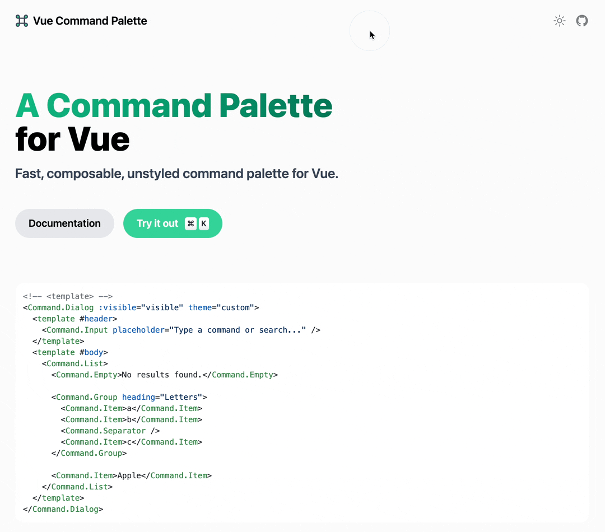

# Command Palette for Vue


> A fast, composable, unstyled `command` + `k` interface (Command Palette) for Vue.

## Preview



## Concepts

Command palette interfaces are used to create a web experience where users can quickly get in charge with keyboard shortcuts, rather than using the mouse.

With macOS's `Spotlight` and `Raycast`'s command palette experience in mind, `vue-command-palette` is designed to provide a fast, composable, unstyled command palette to your site.

## Features

- 🧩 [Compound Component](https://kentcdodds.com/blog/compound-components-with-react-hooks) + [Namespaced Components](https://vuejs.org/api/sfc-script-setup.html#using-components) Design
- 💄 Completely unstyled, but more customizable
- 🔍 Fuzzy search support to find relevant command
- ⌨️ keyboard shortcut support to bind custom keybindings to your command

## Install

```bash
yarn add vue-command-palette
# or
pnpm add vue-command-palette
```

## Usage

Then you can import the `Command` [Compound Component](https://kentcdodds.com/blog/compound-components-with-react-hooks) in your project.

```vue
<template>
  <Command theme="custom">
    <Command.Input placeholder="Type a command or search..." />
    <Command.List>
      <Command.Empty>No results found.</Command.Empty>

      <Command.Group heading="Letters">
        <Command.Item>a</Command.Item>
        <Command.Item>b</Command.Item>
        <Command.Separator />
        <Command.Item>c</Command.Item>
      </Command.Group>

      <Command.Item>Apple</Command.Item>
    </Command.List>
  </Command>
</template>

<script lang="ts" setup>
import { ref } from 'vue'
import { Command } from 'vue-command-palette'
</script>

<style>
// import your custom css
@import '~/assets/css/custom.css';
</style>
```

or in a dialog:

```vue
<template>
  <Command.Dialog :visible="visible" theme="custom">
    <template #header>
      <Command.Input placeholder="Type a command or search..." />
    </template>
    <template #body>
      <Command.List>
        <Command.Empty>No results found.</Command.Empty>

        <Command.Group heading="Letters">
          <Command.Item>a</Command.Item>
          <Command.Item>b</Command.Item>
          <Command.Separator />
          <Command.Item>c</Command.Item>
        </Command.Group>

        <Command.Item>Apple</Command.Item>
      </Command.List>
    </template>
  </Command.Dialog>
</template>

<script lang="ts" setup>
import { ref } from 'vue'
import { Command } from 'vue-command-palette'

const visible = ref(false)
</script>

<style>
// import your custom css
@import '~/assets/css/custom.css';
</style>
```

### <kbd>Command</kbd> + <kbd>K</kbd> or ?

Do I have to use command + K? No, it's just a convention that you can use any key binding to perform the Command Palette.

> Tips, we use `@vueuse/core` to bind the keybindings

```html
<script lang="ts" setup>
  import { watch } from 'vue'
  import { useMagicKeys } from '@vueuse/core'

  const keys = useMagicKeys()
  const CmdK = keys['Meta+K']

  watch(CmdK, (v) => {
    if (v) {
      console.log('Meta + K has been pressed')
      // do your own logic, maybe make dialog visible
    }
  })
</script>
```

### Events

|     Name      | Description                                                           | Parameters       |
| :-----------: | --------------------------------------------------------------------- | :--------------- |
| `select-item` | Every time an item is being selected in `Command` or `Command.Dialog` | `(item) => void` |

### Styling

All namespaced components have a specific `data-attribute` starting with `command-` that can be used for styling.

eg:

```css
div[command-root=''] {
  background: #ffffff;
}
```

### Animation

#### Command.Dialog

`Command.Dialog` wraped by built-in components [Transition](https://vuejs.org/guide/built-ins/transition.html), you can customize the animation using the name `command-dialog` .

[Example Code](https://github.com/xiaoluoboding/vue-command-palette/blob/main/src/assets/scss/algolia.scss#L193)

#### List Item Height

Animate height using the `--command-list-height` CSS variable.

[Example Code](https://github.com/xiaoluoboding/vue-command-palette/blob/main/src/assets/scss/algolia.scss#L26)

## Namespaced components

With [Namespaced components](https://vuejs.org/api/sfc-script-setup.html#using-components), You can use component tags with dots like `<Foo.Bar>` to refer to components nested under object properties. This is useful when you import multiple components from a single file.

### Command `[command-root=""]`

The root component, Passes the `theme` props to set your own style.

```vue
<Command theme="custom">
  <!-- Contains other namespaced components -->
</Command>
```

### Command.Dialog `[command-dialog=""]`

The root component with a dialog interface, [Teleport](https://vuejs.org/guide/built-ins/teleport.html) dialog to `body` tag. Passes the `theme` props to set your own style, and `visible` props control whether render it.

```vue
<Command.Dialog :visible="visible" theme="custom">
  <!-- Contains other namespaced components -->
  <template #header></template>
  <template #body></template>
  <template #footer></template>
</Command.Dialog>
```

`data-attribute` within dialog

- `[command-dialog-mask]` - the mask is always rendered.
- `[command-dialog-wrapper]` - the wrapper on top of mask.
- `[command-dialog-header]` - the parent of dialog header slot.
- `[command-dialog-body]` - the parent of dialog body slot.
- `[command-dialog-footer]` - the parent of dialog footer slot.

### Command.Input `[command-input=""]`

Usually we need a input in the command palette to search sth.

```vue
<Command.Input
  placeholder="Type a command or search..."
  v-model:value="inputValue"
/>
```

### Command.List `[command-list=""]`

Contains items and groups. Animate height using the `--command-list-height` CSS variable.

```css
[command-list] {
  min-height: 300px;
  height: var(--command-list-height);
  max-height: 500px;
  transition: height 100ms ease;
}
```

```vue
<Command.List>
  <!-- Contains Group, Item, Empty -->
</Command.List>
```

### Command.Group `[command-group=""]`

Group items (`[command-group-items]`) together with the given `heading` (`[command-group-heading]`)

```vue
<Command.Group heading="Perference">
  <Command.Item>Toggle Dark Mode</Command.Item>
  <Command.Item>Change Language</Command.Item>
</Command.Group>
```

### Command.Item `[command-item=""]`

Passed the `data-value`, we use `data-value` to fetch the value.

```vue
<Command.Item
  v-for="item in items"
  :data-value="item.label"
  :shortcut="item.shortcut"
  :perform="item.perform"
  @select="(itemInfo) => console.log('selected', itemInfo)"
  // the itemInfo.value is some as `data-value`
>
  {{ item.label }}
</Command.Item>
```

### Command.Separator `[command-separator=""]`

Usually used to distinguish between different groups

### Command.Empty `[command-empty=""]`

Automatically renders when there are no results for the search query.

### Command.Loading `[command-loading=""]`

Your should manually control `loading`

## Inspiration

- [cmdk](https://github.com/pacocoursey/cmdk) - Fast, unstyled command menu React component.
- [kbar](https://github.com/timc1/kbar) - fast, portable, and extensible cmd+k interface for your site.

## License

MIT [@xiaoluoboding](https://github.com/xiaoluoboding)
